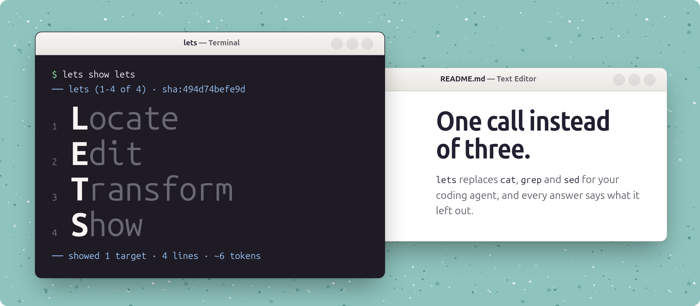

<h1></h1>

Locate · Edit · Transform · Show — a file-operations CLI for coding agents (Claude Code, Codex):
one Bash call reads, searches, edits or transforms several files and returns bounded, numbered
output whose footer names everything it left out.

[](https://github.com/mayberuk/lets/actions/workflows/ci.yml)
[](https://github.com/mayberuk/lets/releases/latest)
[](#license)
[](Cargo.toml)
[](#install)
[](#agent-setup)

Website: [lets.mayberuk.com](https://lets.mayberuk.com). An agent reading this repo instead
should start at [lets.mayberuk.com/llms.txt](https://lets.mayberuk.com/llms.txt).

## Install

```console
$ curl -fsSL https://raw.githubusercontent.com/mayberuk/lets/main/install.sh | sh
```

`install.sh` detects an existing `lets`, updates it in place if it's this project's build, and
offers to wire up agent hooks. It refuses, naming the one it found, if a different `lets` is
already first on `PATH`. Its own flags:

```
Usage: install.sh [--version vX.Y.Z] [--hooks=claude-code,codex | --no-hooks] [--check] [--uninstall] [--yes]
```

Or fetch a release binary directly, the `dist`-generated one-liner:

```console
$ curl --proto '=https' --tlsv1.2 -LsSf https://github.com/mayberuk/lets/releases/latest/download/lets-installer.sh | sh
```

## Update and check for updates

```console
$ lets update --check
$ lets update
```

`update --check` reports whether a newer release exists without installing it; `update` installs
it. Both refuse, naming the one they found, when a different `lets` comes first on `PATH`.

## Agent setup

```console
$ lets hooks install claude-code
$ lets hooks install codex
```

Each merges the hooks that agent's harness supports into its own user-level settings — for
Claude Code, a `SessionStart` paragraph and a `PreToolUse` classifier that blocks a `cat`, `grep`
or `sed -i` of a repo file only when it has a runnable `lets` replacement, and says what that
replacement is. `lets hooks uninstall claude-code` and `lets hooks uninstall codex` remove them
again. Installing only ever writes into the agent's own settings; nothing here modifies your
shell profile.

## Quickstart

```
lets — Locate · Edit · Transform · Show          one call, bounded output, post-state returned

  show   <target>...            read files, ranges, anchors, symbols — several per call
  find   <pattern> [path]...    search; hits print as path:line; capped at 50, says so
                                ≤10 hits in ≤3 files show enclosing function or ±5 lines,
                                unless -A/-B/-C/--files/--count/--json/--jsonl/--no-expand
                                -F/-i/-w · -A/-B/-C context · --files/-l · --count/-c
                                grep's -n/--line-number -r -R -E -H are accepted as no-ops
  edit   <target> --old --new   exact-once replace; --all; --insert-after; --from - for batches
                                batch: --from - <<'LETS' then @@ file, <<<<<<< old,
                                ======= new, >>>>>>> per edit — full example: lets edit --help
  transform <file> --set k=v    --append k=v; JSON/YAML/TOML/frontmatter keys, formatting preserved
  write  <path> < stdin         create a file; refuses to overwrite without --force

  targets   f.ts   f.ts:40-80   "f.ts@'regex'" -A 20   f.ts#funcName   f.md#'Heading'
  exits     0 done · 1 none/over cap · 2 ambiguous · 3 check failed (reverted) · 4 over budget
            5 changed since --if · 6 outside tree · 7 unsupported file · 8 batch partly written
  after an edit the changed region is in the output — do not cat or sed -n to check it
```

The block above is `lets guide`'s own screen (`docs/guide.md`), copied verbatim rather than
re-described, so the two cannot drift apart silently. Runnable examples for every verb, generated
from the test suite, live under [`docs/examples/`](docs/examples/); the exit codes, the `--json`
and `--jsonl` shapes and the footer contract a calling program relies on are in
[`docs/agents.md`](docs/agents.md).

## Measured

A large-repo trial — five tasks sent as five turns of one Claude Code session, on a private
17.7k-file Go monorepo, checked against expected values derived from each task — compared a
stock session (`none`) against one with `lets hooks install claude-code` (`lean`), no other
change:

| model | n, lean vs none | tool calls | wall time | checks passed | cost |
|---|---|---|---|---|---|
| Sonnet 5 | 9 vs 6 | −16% (64.6 vs 76.5) | −11% (403 s vs 451 s) | 99.1% vs 97.8% (339/342 vs 223/228) | −0.5% ($1.349 vs $1.356), cost-neutral |
| Opus 5.5 | 6 vs 6 | −16% | −12% | 100% both arms | +8% mean ($1.003 vs $0.929; +4% median) |

Local latency, median p50 across three `just bench-gate` wall-clock passes against the generated
fixture corpus, on an 8-core/16-thread AMD Ryzen 7 5700X3D (kernel 6.17.4-76061704-generic):
`guide` 0.8 ms, `hook classify` 1.1 ms (1.17× `bash -n`), `show` on 200 lines 0.9 ms (1.64×
`cat`), `find` on 2,000 files 7.8 ms (1.14× `rg`), `edit` plus a syntax check 2.3 ms, a 10-file
batch edit 23.0 ms, `transform` on a YAML file 3.2 ms. Measured once on the same private
monorepo, outside the bench-gate harness: `show` at 2–4 ms, `find` at roughly 110 ms across the
whole tree, and a symbol lookup plus an edit on its largest file (17.9k lines) at 116 ms and
183 ms.

0.0.1 → 0.0.2 on the same machine, interleaved runs of both binaries (one run of each per
iteration, so a shared-machine load burst lands in every arm equally): `show` on a 200-line file
1.45× faster, `show` on an 8 MiB file 4.10× faster (default window) and 2.86× faster (`--all`),
`find` across the 2,000-file corpus 1.70× faster (1.04× `rg`), `find` on this repo's own root
2.11× faster (1.20× `rg`), `hook classify` 1.29× faster, `guide` startup 1.42× faster, `edit`
1.37× faster, `transform` 1.38× faster.

Method, sample sizes and caveats: [`docs/benchmarks.md`](docs/benchmarks.md).

## How it steers agents

Discovery is `SessionStart` only: `lets hooks install claude-code` prints a short paragraph
explaining `lets` and its verbs at the start of every session, `compact` included, so it comes
back after every compaction. It does not use Claude Code's system-prompt-append flag — a trial
found that route held tool-call batching to zero across every session it ran, for the same or
higher cost, so nothing is appended to the system prompt.

## Exit codes

Every non-zero exit writes one diagnostic line per failure to stderr and `ERROR_CODE=<slug>` as
the last line.

| Exit | Means |
|---|---|
| 0 | done |
| 1 | nothing matched, or `find` was over its hit cap |
| 2 | `--old` or the target matched more than once; every candidate is listed |
| 3 | the edit broke the file's syntax; it was reverted |
| 4 | content exceeded `--max-bytes` and no `--budget` was given |
| 5 | the file changed since the `--if sha:…` it was given |
| 6 | a write landed outside the working tree; pass `--allow-outside` |
| 7 | binary, hardlinked, non-UTF-8 in the matched region, over size, or an unsupported edit |
| 8 | a batch partly landed; the footer names which files changed |
| 64 | the command line is malformed |

The full table, with each exit's slug: [`docs/agents.md`](docs/agents.md#exit-codes).

## License

Licensed under either of [Apache License, Version 2.0](LICENSE-APACHE) or
[MIT license](LICENSE-MIT) at your option.

## Contributing

See [`CONTRIBUTING.md`](CONTRIBUTING.md).
